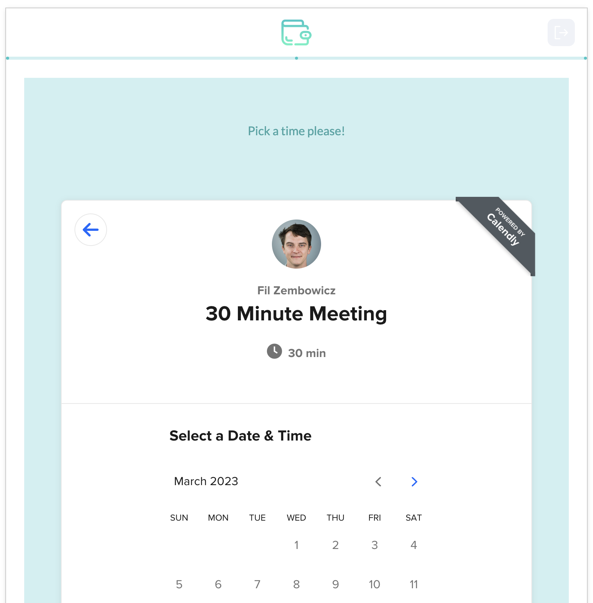

# calendly

A formsort [custom question](https://github.com/formsort/oss/tree/master/packages/custom-question-api) implementing a Calendly embed, written in [Svelte](https://svelte.dev).



It's helpful for prompting a responder to schedule a meeting within a flow, without needing redirects.

## Usage

A built version of the question itself is hosted on Github Pages: https://formsort.github.io/custom-question-examples/calendly-question/build/. If you want to customize it, you'd need to the built version of this package somewhere yourself.

1. Add the Calendly URL as the `?url=` parameter for this page. So, if your calendly URL is normally `https://calendly.com/xyz/30min`, you'd have `https://formsort.github.io/custom-question-examples/calendly-question/build/?url=https://calendly.com/xyz/30min`
1. The above URL can be set as the _Source URL_ for a [custom question](https://docs.formsort.com/building-flows/content-types/custom) within the Formsort Studio, and should work out of the box.
1. The calendly embed is rather tall - you may want to set the _Default width_ to 100% so that it takes up the full width of the form, and the _Default height_ to something like 1000px. Unfortunately the official Calendly documentation does not offer a better solution to [removing scroll bars](https://help.calendly.com/hc/en-us/articles/360019861794-Common-embed-questions#3).

## Note on the scheduled event

The answer that this question provides is a Calendly `scheduled_event` URL, that will look something like https://api.calendly.com/scheduled_events/b58878ef-6ab7-4a5a-9211-e9a3910f588c. This is not a publicly-accessible URL, but rather a reference to the scheduled event.

If you need more information about the event, such as the time it was scheduled, you can use Calendly's own [Get Event](https://developer.calendly.com/api-docs/e2f95ebd44914-get-event) API endpoint. You can even use a Formsort [API answer](https://docs.formsort.com/building-flows/schemas/api-answers) to do this, since you can set the Authorization header on the request.

## Developing

```bash
yarn
yarn dev
```

## Building

```bash
yarn build
```
