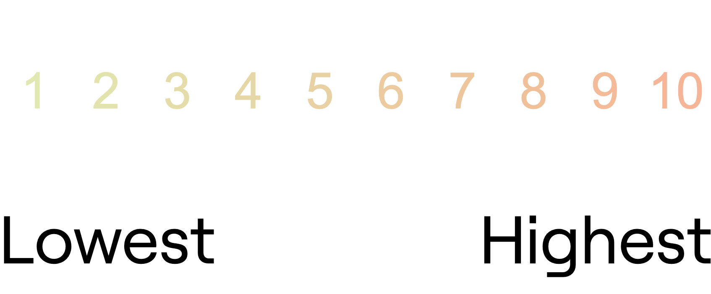

# zoom-slider

A formsort [custom question](https://github.com/formsort/oss/tree/master/packages/custom-question-api) implementing a funky, zoomy slider, written in [Svelte](https://svelte.dev).


It's probably not a great UX, but it's flashy, and a nice example of what's possible with custom questions.

## Usage

A built version of the question itself is hosted on Github Pages: https://formsort.github.io/custom-question-examples/zoom-slider/build/

This can be set as the _Source URL_ for a [custom question] within the Formsort Studio, and should work out of the box. You may want to set the _Default width_ to 100% so that it takes up the full width of the form.

If you want to customize and use this, you'll want to build and host it yourself.

## Parameters

The question can be used as-is, but can also be customizd by adding `minLabel` and `maxLabel` URL search parameters which will be used as range limits.

As an example, loading with `?minLabel=Lowest&maxLabel=Highest` will look something like the following (see live):



## Developing

```bash
yarn
yarn dev
```

## Building

```bash
yarn build
```
